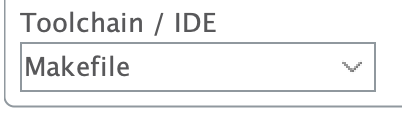
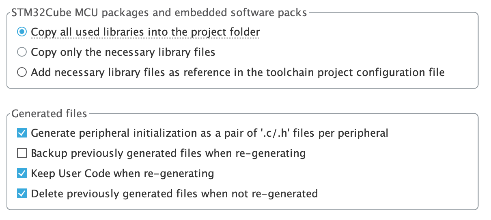

# CMake_STM32
using cmake to quickly organizing your cubemx stm32 project  
> features:
> 1. HAL/LL and some system library are built as static library so that each time you add your new files/library, you won't wait for a long time rebuilding HAL/LL lib
> 2.
## tools
* STM32CubeMX(Generate with Makefile)  
  and have settings as below
* STM32CubeProgramer(Flash tool)
* CMake
* arm-none-eabi-gcc toolchain(strongly suggest)
## configure
1. drag `CMakeLists.txt` from this rep to the root path of your project(which is generate automatically by STM32CubeMX)
2. edit your project name with below
~~~cmake
project(A_NAME_THAT_YOU_LIKE)
~~~
3. edit `${MCU_FLAGS}` to your hardware platform. if you don't know how to write, find them in `Makefile` which generate by CubeMX
~~~makefile
# cpu
CPU = -mcpu=cortex-m4

# fpu
FPU = -mfpu=fpv4-sp-d16

# float-abi
FLOAT-ABI = -mfloat-abi=hard
~~~
4. check defines and include dir recording to your `Makefile`
5. edit your file and lib settings
6. use it well

## build and flash
~~~zsh
mkdir build # anyname\anywhere
cmake ../   # ../ is the dir with CMakeLists.txt
make -j     # build with this arg to have max speed
make flash  # flash to your device
~~~